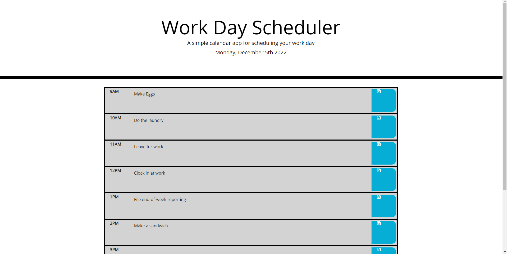
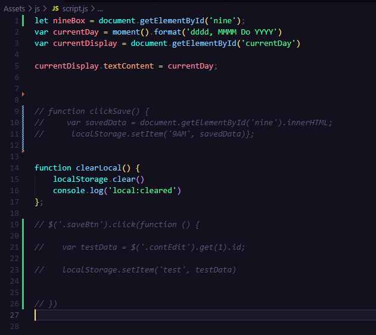
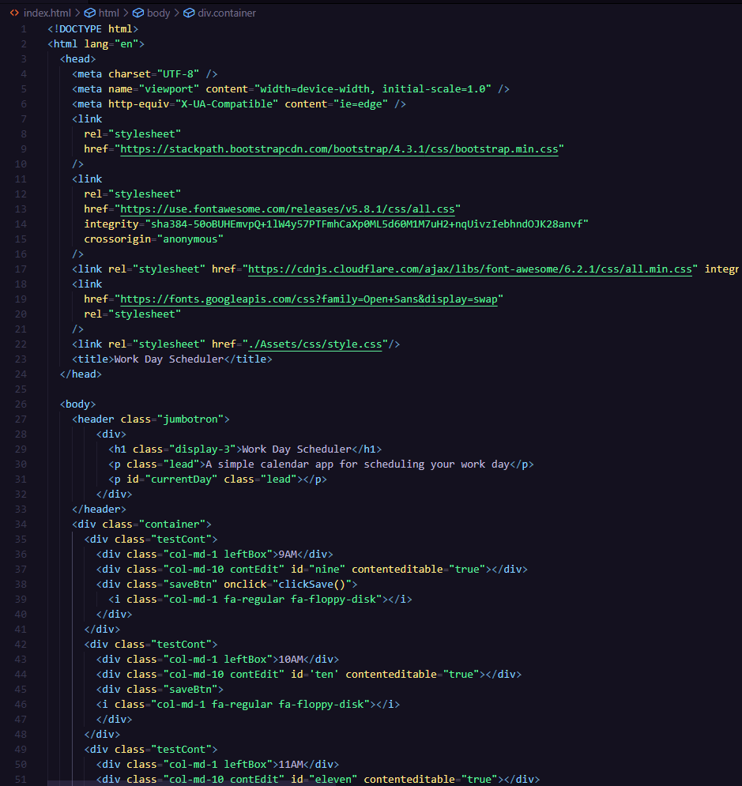
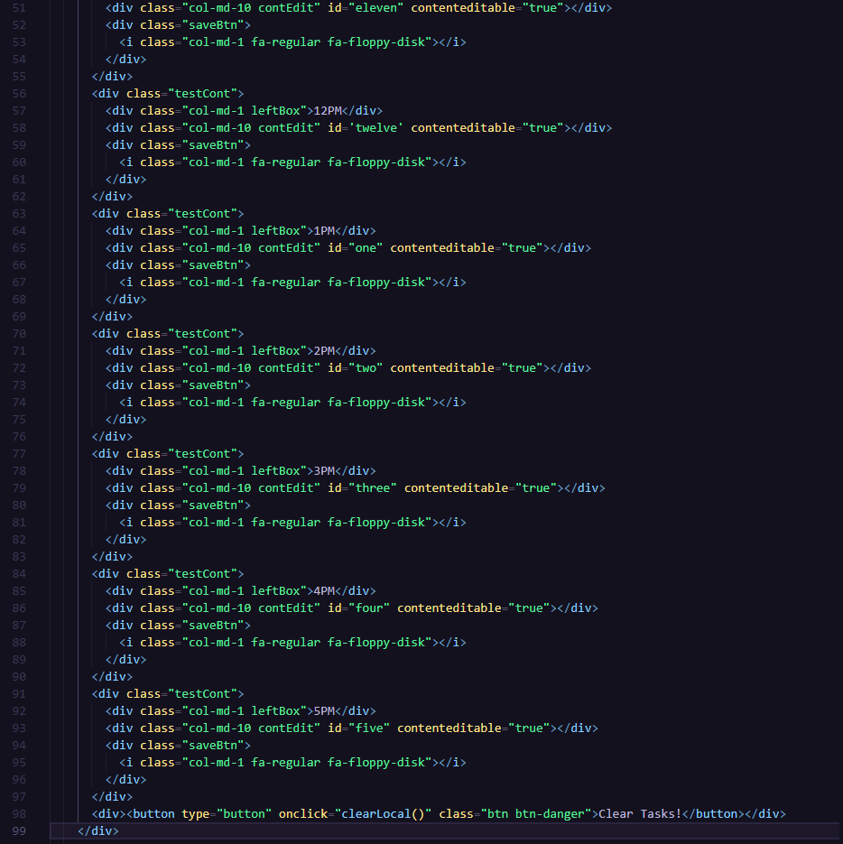

# Challenge-05 Work-Day Scheduler

## Description

This application is designed to function as a Work-Day Scheduler that allows the user to plan out their day by the hour, and have all tasks save to localStorage and persist through browser refresh. This application also utilizes moment.js to handle some current date display and additional functionality that allows for color coordinating time blocks based on the time of day. 

## What Adversity Did I Face During Development?

I drained multiple hours trying to understand the jquery $(this).sibling syntax and have still been unable to succesfully get the localStorage component of the project to work. 

## Future Development

The last two things that need to be fixed on this project are 1) utilizing jquery to save all timeblocks to localStorage and have those tasks persist through refresh and remain on the page. 

## View My Work Here ↓

## Application Screenshot ↓

## Code Screenshots ↓

## License

This project is unlicensed and intended to be used in a learning environment only. 
